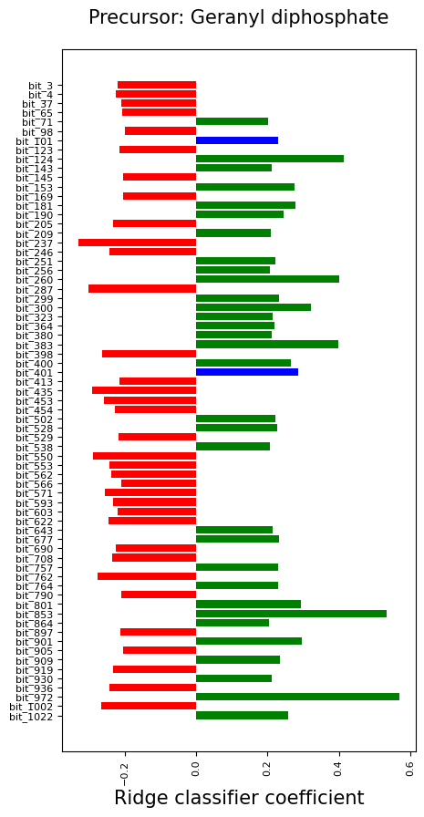
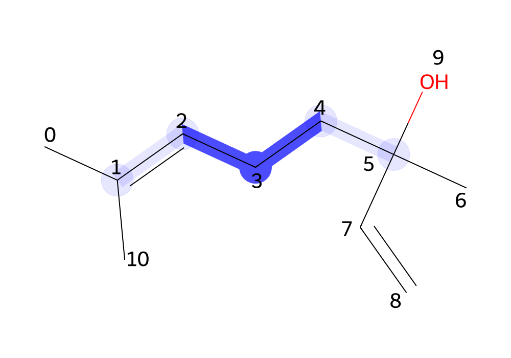
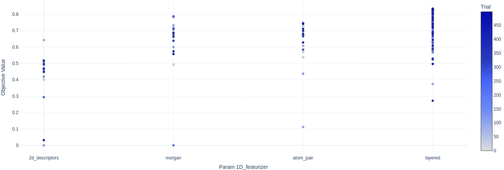
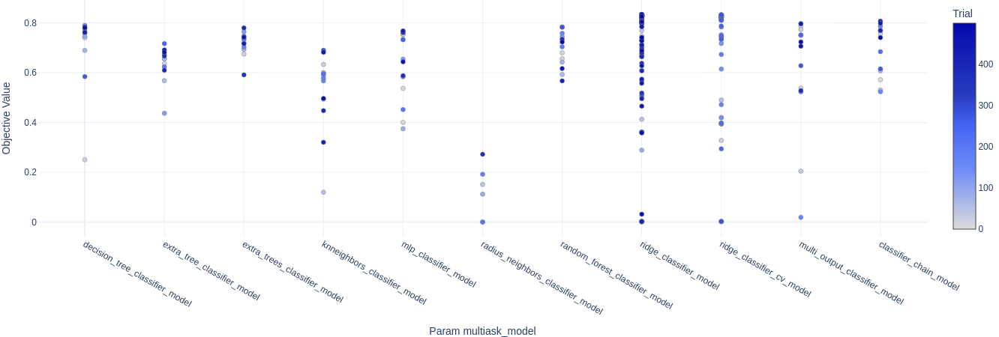
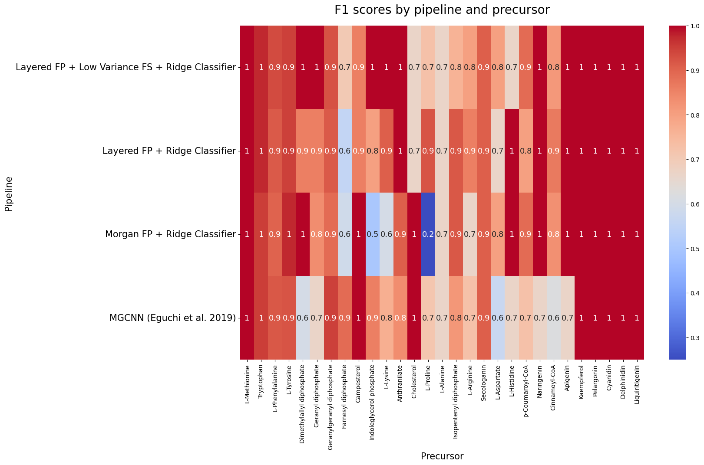

# SMPrecursorPredictor
A ML pipeline for the prediction of specialised metabolites starting substances.

### Table of contents:

- [Installation](#installation)
    - [Manually](#Manually)
    - [Pypi](#pypi)
- [Making predictions](#making-predictions)
- [Methods](#methods)
    - [Data](#data)
    - [AutoML](#automl)
    - [Analysis of the results](#analysis-of-the-results)
    - [Metrics](#metrics)
    - [Similarity matrix and t-SNE generation](#similarity-matrix-and-t-sne-generation)
    - [TPE algorithm](#tpe-algorithm)
    - [Statistical methods](#statistical-methods)
- [Results](#results)
    - [AutoML results](#automl-results)

## Installation

### Manually

1. Clone the repository and move into the directory:

```bash
git clone
cd SMPrecursorPredictor
```

2. Create a conda environment and activate it:

```bash
conda create -n sm_precursor_predictor python=3.10
conda activate sm_precursor_predictor
```

3. Install the dependencies:

```bash
pip install -r requirements.txt
```

4. Install the package:

```bash
pip install .
```

### Pypi

1. Create a conda environment and activate it:

```bash
conda create -n sm_precursor_predictor python=3.10
conda activate sm_precursor_predictor
pip install SMPrecursorPrediction
```

## Making predictions

Models available: 

- Layered FP + Low Variance FS + Ridge Classifier
- Morgan FP + Ridge Classifier

```python
from sm_precursor_predictor import predict_precursors
precursors = predict_precursors(
            ["[H][C@]89CN(CCc1c([nH]c2ccccc12)[C@@](C(=O)OC)(c3cc4c(cc3OC)N(C)[C@@]5([H])[C@@]"
             "(O)(C(=O)OC)[C@H](OC(C)=O)[C@]7(CC)C=CCN6CC[C@]45[C@@]67[H])C8)C[C@](O)(CC)C9",
             "COC1=C(C=CC(=C1)C2=C(C(=O)C3=C(C=C(C=C3O2)O)O)O[C@H]4[C@@H]([C@H]([C@H]([C@H](O4)CO)O)O)O)O"],
             model="Layered FP + Low Variance FS + Ridge Classifier")
print(precursors)
```

or

read a csv file with a column of SMILES and a column of IDs and save the predictions in a csv file:

```python
from sm_precursor_predictor import predict_from_csv
predictions = predict_from_csv("path_to_csv", 
                               smiles_field="SMILES", 
                               ids_field="ID",
                               model="Layered FP + Low Variance FS + Ridge Classifier")
predictions.to_csv("path_to_save_predictions.csv")
```

## Making and explaining predictions

This is only possible with one model: *Morgan FP + Ridge Classifier*.

Example with linalool:

```python
from sm_precursor_predictor import get_prediction_and_explanation

prediction, images, plots = get_prediction_and_explanation(smiles="CC(=CCCC(C)(C=C)O)C", threshold=0.20)
```


```
prediction
```


```
['Geranyl diphosphate']
```

```
images[0]
```



## Methods

### Data

The final dataset can be found in **[final_dataset.csv](models_and_datasets/final_dataset/final_dataset_top_v2.csv)**. The LotusDB compounds predictions can be found at **[predictions](models_and_datasets/analysis/predictions_lotusdb/LOTUSDB_predictions_plants.csv)**.

The exploration of the dataset can be found at **[dataset_analysis.ipynb](models_and_datasets/analysis/dataset_analysis.ipynb)**.

### AutoML 

The AutoML was run using docker. To run using docker you must consider the following files:

- **[Dockerfile](models_and_datasets/analysis/results_for_new_dataset/Dockerfile)**
- **[run.sh](models_and_datasets/analysis/results_for_new_dataset/run.sh)**

Alternatively, if you're rather interested in running the AutoML with a python script, consider the following:

- **[train_models.py](models_and_datasets/analysis/results_for_new_dataset/train_models.py)**

### Analysis of the results

For the analysis of the results refer to the following files:

- **[Main results](models_and_datasets/analysis/results_for_new_dataset/results_analysis.ipynb)**
- **[Alkaloids dataset - Eguchi et al. 2019](models_and_datasets/analysis/results_for_alkaloids_dataset/pipeline_for_alkaloids_data.ipynb)**
- **[Challenging datasets](models_and_datasets/analysis/results_for_challenging_datasets/assess_for_challenging_datasets.ipynb)**
- For checking the model interpretability - **[Monoterpenoid indole alkaloids](models_and_datasets/analysis/results_for_challenging_compounds/alkaloids_derived_from_tryptophan.ipynb)** and **[others](models_and_datasets/analysis/case_studies/predict_for_case_studies.ipynb)**.

The results for the MGCNN can be found at [this link](https://github.com/jcapels/mgcnn_alkaloid.git).

### Metrics 

The formula for mF1 is defined as:

$$
\text{mF1} = \frac{1}{N} \sum_{i=1}^{N} \frac{2 \cdot \text{Precision}_i \cdot \text{Recall}_i}{\text{Precision}_i + \text{Recall}_i}
$$

The formula for mRecall is defined as:

$$
\text{mRecall} = \frac{1}{N} \sum_{i=1}^{N} \frac{\text{True Positives}_i}{\text{True Positives}_i + \text{False Negatives}_i}
$$

The formula for mPrecision is defined as:

$$
\text{mPrecision} = \frac{1}{N} \sum_{i=1}^{N} \frac{\text{True Positives}_i}{\text{True Positives}_i + \text{False Positives}_i}
$$

where $N$ denotes the total number of classes, with $\text{Precision}_i$ and $\text{Recall}_i$ corresponding to the precision and recall for class $i$, respectively. $\text{True Positives}_i$ are the true positive predictions for class $i$, and $\text{False Negatives}_i$ are the missed predictions for class $i$. Finally, the $\text{False Positives}_i$ are the wrong positive predictions.

### Similarity matrix and t-SNE generation

A similarity matrix between all the Morgan fingerprints of the compounds in the whole dataset was generated to assess their similarity. The similarity function was the Tanimoto similarity index. A t-distributed Stochastic Neighbor Embedding (t-SNE) was created from this matrix to reduce dimensionality and for visualization.

### TPE algorithm

The TPE algorithm optimizes hyperparameter selection by modelling the probability of hyperparameter effectiveness, prioritizing those regions that show promise based on an objective function $f(x)$, where $x$ represents the hyperparameters. This function is aimed at maximization. The algorithm divides the hyperparameters into two categories based on a threshold $\gamma$: $l(x)$ for those leading to higher (better) objective function values and $g(x)$ for those leading to lower (worse) values. It then preferentially samples new hyperparameters from $l(x)$, the distribution indicating better performance.


### Statistical methods

Given metric values for two models across $n$ tasks, $m_{1i}$ and $m_{2i}$, calculate the differences $d_i = m_{1i} - m_{2i}$ for each task $i$. For these differences, ignore $d_i = 0$ and rank the absolute differences $|d_i|$, assign ranks $R_i$ and compute $W^+ = \sum_{d_i > 0} R_i$ and $W^- = \sum_{d_i < 0} R_i$, the test statistic $W$ is defined as $W = \min(W^+, W^-)$. The p-value is calculated as the probability of observing a value of $W_{\text{ref}}$, determined by a reference distribution under the null hypothesis, as extreme as or more extreme than the observed value ($W$). The null hypothesis is that there are no significant differences between the metric values of the two models. A p-value lower than 0.05 is considered sufficient to reject the null hypothesis.

In the context of cross-validation, given two models evaluated across $n$ tasks and $r$ folds, resulting in performance metrics $m_{Aij}$ and $m_{Bij}$ for models $A$ and $B$ respectively, for each task $i$ and fold $j$, perform the following steps: calculate the differences $d_{ij} = m_{Aij} - m_{Bij}$, rank the absolute differences $|d_{ij}|$, and apply the Wilcoxon Signed-Rank test as explained above.


## Results

### AutoML results

The figures below show the automatic machine learning model results. The first figure shows the features used during the optimization and the mF1 score on the validation set for each trial. Morgan and layered fingerprints (FP) stood out as the best features. 



The figure below shows the models trained and the mF1 scores obtained by each model on the validation set. The ridge classifiers stood out unequivocally.



Figure below shows the F1 scores for each precursor and model.




