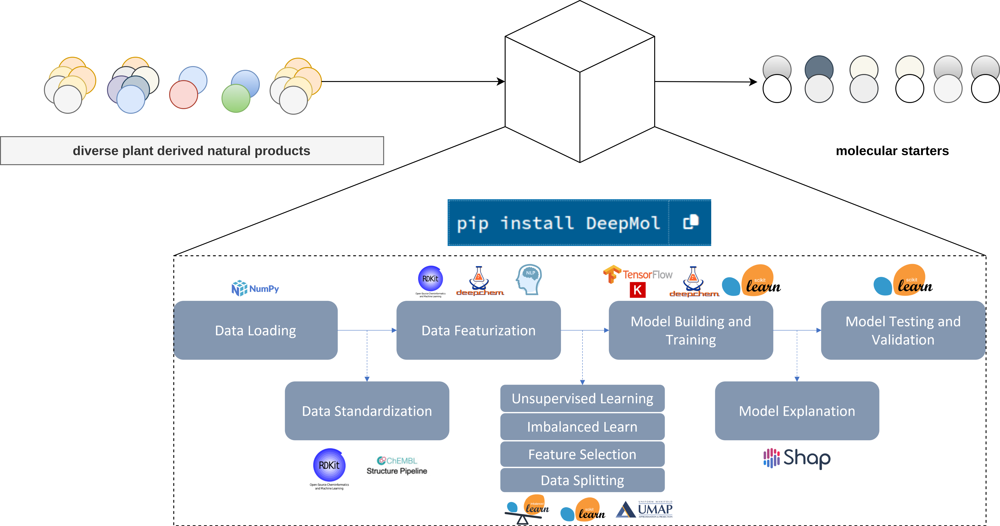
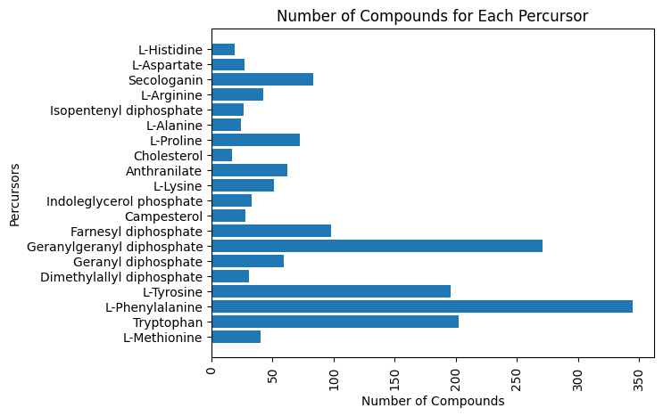

# SMPrecursorPredictor
A ML pipeline for the prediction of specialised metabolites precursors.

### Table of contents:

- [Installation](#installation)
    - [Manually](#Manually)
    - [Pypi](#pypi)
- [Making predictions](#making-predictions)
- [Methods](#methods)
    - [Problem setup](#problem-setup)
- [License](#licensing)

## Installation

### Manually

1. Clone the repository and move into the directory:

```bash
git clone
cd SMPrecursorPredictor
```

2. Create a conda environment and activate it:

```bash
conda create -n sm_precursor_predictor python=3.10
conda activate sm_precursor_predictor
```

3. Install the dependencies:

```bash
pip install -r requirements.txt
```

4. Install the package:

```bash
pip install .
```

### Pypi

1. Create a conda environment and activate it:

```bash
conda create -n sm_precursor_predictor python=3.10
conda activate sm_precursor_predictor
pip install SMPrecursorPredictor
```

## Making predictions

```python
from sm_precursor_predictor import predict_precursors
precursors = predict_precursors(
            ["[H][C@]89CN(CCc1c([nH]c2ccccc12)[C@@](C(=O)OC)(c3cc4c(cc3OC)N(C)[C@@]5([H])[C@@]"
             "(O)(C(=O)OC)[C@H](OC(C)=O)[C@]7(CC)C=CCN6CC[C@]45[C@@]67[H])C8)C[C@](O)(CC)C9",
             "COC1=C(C=CC(=C1)C2=C(C(=O)C3=C(C=C(C=C3O2)O)O)O[C@H]4[C@@H]([C@H]([C@H]([C@H](O4)CO)O)O)O)O"])
print(precursors)
```

or

read a csv file with a column of SMILES and a column of IDs and save the predictions in a csv file:

```python
from sm_precursor_predictor import predict_from_csv
predictions = predict_from_csv("path_to_csv", 
                               smiles_field="SMILES", 
                               ids_field="ID")
predictions.to_csv("path_to_save_predictions_csv")
```

## Methods

### Problem setup

Data integration:
- Alkaloids: from Eguchi et al 2019;
- Terpenoids, phenols and gluconates: curated data from KEGG

Multi-label classification problem: 



### Data integration results



### Splitted dataset


### Model results

With a few lines of code we tested:

- 5 molecular fingerprints alone and combinations;
- 3 different standardization methods
- 7 models from sklearn for multilabel classification.
- 6 different optimization methods: an evolutionary algorithm, MOTPE, random search, TPE, CMAES and quasi monte carlo;
- 
In total, we tested 3000 combinations, 500 for each method of optimization;


### Best trials stats - best fingerprints


### Best trials stats - best models


### Best pipelines

- Standardizer: ChEMBLStandardizer
- Fingerprints: 
- - Layered fingerprints (size: 2048, minimum path: 3, maximum path: 8)
- - AtomPair fingerprints (size: 2048, minimum length: 2, maximum length: 40, does not include information on chirality)
- Model: 
- - RidgeClassifier(alpha=7.338782054460601, fit_intercept=False,solver='sparse_cg')


